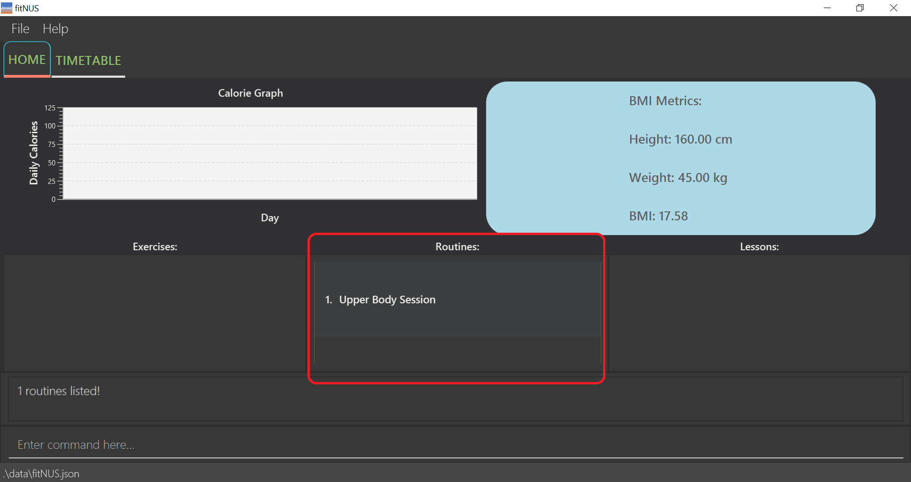
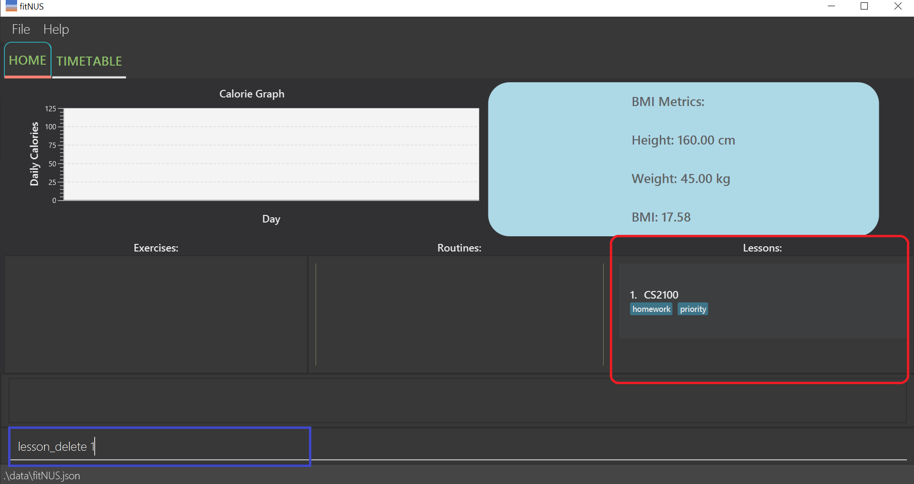

* Table of Contents
{:toc}

------------------------------------------------------------------------------------------------------------------------
## 1. Introduction (Licheng)

fitNUS is tailored for **NUS students** that are interested in staying healthy and keeping fit. It is suitable for **all
fitness levels** and is equipped with a **customisable timetable** for you to manage your time wisely and slot in your
workout routines with ease.

fitNUS is  **optimized for use via a Command Line Interface** (CLI) while still having the benefits of a Graphical User
Interface (GUI). If you can type fast, fitNUS can get your scheduling tasks done faster than traditional GUI apps.

   

--------------------------------------------------------------------------------------------------------------------
## 2. Quick start

1. Ensure you have Java `11` or above installed in your Computer.

1. Download the latest `fitNUS.jar` from [here](https://github.com/AY2021S1-CS2103T-T09-2/tp/releases).

1. Copy the file to the folder you want to use as the _home folder_ for your fitNUS.

1. Double-click the file to start the app. The GUI similar to the above should appear in a few seconds.
Note how the app contains some sample data. 

1. Type the command in the command box and press Enter to execute it. Here are some sample commands you can try:

   * **`exercise_add`**`n/Curls t/Upper` : Creates an Exercise named "Curls" with a "Upper" tag.

   * **`routine_create`**`r/Upper Body Session` : Creates a routine names "Upper Body Session"

   * **`routine_add `**`r/Upper Body Session e/Curls` : Adds an exercise named "Curls"
   to a routine named "Upper Body Session"

   * **`timetable_add_routine`**`r/Upper Body Session d/Monday T/1600-1800` : Adds the routine "Upper Body Session"
   to your timetable on Monday at 1600HRS - 1800HRS.

1. Refer to the [Features](#features) below for details of each command.

--------------------------------------------------------------------------------------------------------------------
## 3. Features

### 3.1 Exercise (Licheng)

#### 3.1.1 Create new exercise : `exercise_add`

Creates a new exercise in fitNUS with the given exercise name.

Format: `exercise_add n/EXERCISE_NAME [t/TAG]`

Example:
* `exercise_add n/Bench Press t/Upper` Creates a new exercise with the name "Bench Press"
and tags "Upper".

#### 3.1.2 Delete exercise : `exercise_delete`

Deletes an existing exercise in fitNUS corresponding to the given index.

Format: `exercise_delete INDEX`

Example:
* `exercise_delete 1` Deletes the exercise at index 1 in the list.

#### 3.1.3 List exercises : `list_exercises`

Lists all existing exercises in fitNUS.

Format: `list_exercises`

#### 3.1.4 Find exercises : `find_exercises`

Finds all exercises in fitNUS whose names contain any of the specified keywords.

Format: `find_exercises KEYWORD [MORE_KEYWORDS]`

Example:
* `find_exercises Bench Press` Lists all exercises with names matching "Bench" and "Press".

;

### 3.2 Routine (Jing Qian)

#### 3.2.1 Create new routine : `routine_create`

Creates a new routine in fitNUS with the given routine name.

Format: `routine_create r/ROUTINE_NAME`

Examples:
* `routine_create r/Leg Workout` Creates a new routine with the name "Leg Workout".

#### 3.2.2 Delete routine : `routine_delete`

Deletes an existing routine in fitNUS corresponding to the given index.

Format: `routine_delete INDEX`

Examples:
* `routine_delete 3` Deletes the routine with index 3 in the list.

#### 3.2.3 Add exercise to routine : `routine_add`

Adds an existing exercise in fitNUS to a specific routine in fitNUS.

Format: `routine_add r/NAME_OF_TARGET_ROUTINE e/EXERCISE_NAME`

Examples:
* `routine_add r/Leg Workout e/Squat` Adds an exercise named "Squat" to the routine "Leg Workout".

#### 3.2.4 Delete exercise from routine : `routine_delete_exercise`

Removes an exercise from a specific routine.

Format: `routine_delete_exercise r/NAME_OF_TARGET_ROUTINE e/EXERCISE_NAME`

Examples:
* `routine_delete_exercise r/Full Workout e/Squat` Deletes the exercise "Squat" from the routine "Full Workout".

#### 3.2.5 View routine details : `routine_view`

Views the details of a certain routine.

Format: `routine_view INDEX`

Examples:
* `routine_view 2` Views routine with the index 2.

**Before input:**

**After input:**

#### 3.2.6 List routines : `routine_list`

Lists out all the routines in fitNUS.

Format: `routine_list`

#### 3.2.7 Find routines : `find_routines`

Finds all routines with matching keyword given.

Format: `find_routines KEYWORD`

Example:
* `find_routines upper` Finds all routines with the keyword "upper" in its name, regardless of uppercase or lowercase.

**Input:**

**Result:**

### 3.3 Lesson (Nicholas)

#### 3.3.1 Create new lesson : `lesson_add`

Creates a new lesson in fitNUS with the given lesson name.

Format: `lesson_add n/EXERCISE_NAME [t/TAG]`

Example:
* `lesson_add n/CS2100 t/Thursday t/0900 t/1hours` Creates a new lesson with the name "CS2100"
and tags "Thursday", "0900" and "1hours".

#### 3.3.2 Delete lesson : `lesson_delete`

Deletes an existing lesson in fitNUS corresponding to the given index.

Format: `lesson_delete INDEX`

Example:
* `lesson_delete 2` Deletes the lesson at index 2 in the list.

**Before**

**After**

#### 3.3.3 List lessons : `list_lessons`

Lists all existing lessons in fitNUS.

Format: `list_lessons`

#### 3.3.4 Find lessons : `find_lessons`

Finds all lessons in fitNUS whose names contain any of the specified keywords.

Format: `find_lessons KEYWORD [MORE_KEYWORDS]`

Example:
* `find_lessons CS2103T` Lists all lessons with names matching "CS2103T".

;

### 3.4 Timetable

#### 3.4.1 Add routine to timetable : `timetable_add_routine`

Adds a complete routine into the timetable in fitNUS.

Format: `timetable_add_routine r/ROUTINE_NAME d/DAY_OF_THE_WEEK T/TIMING`

Examples:
* `timetable_add_routine r/Leg Workout d/Monday T/1600-1800`
Adds routine "Leg Workout" to timetable on Monday, 1600-1800.

#### 3.4.2 Add lesson to timetable : `timetable_add_lesson`

Adds a lesson into the timetable in fitNUS.

Format: `timetable_add_lesson n/LESSON_NAME d/DAY_OF_THE_WEEK T/TIMING`

Examples:
* `timetable_add_lesson n/CS2103T d/Monday T/1200-1400`
Adds lesson "CS2103T" to timetable on Monday, 1200-1400.

`

#### 3.4.3 Delete routine or lesson from schedule : `timetable_delete`

Deletes a routine or lesson from the timetable in fitNUS.

Format: `timetable_delete d/DAY_OF_THE_WEEK t/TIMING`

Examples:
* `timetable_delete d/Monday t/1600-1800`
Deletes the routine or lesson scheduled on Monday, 1600-1800.

#### 3.4.4 View timetable : `timetable_view`

Views the timetable in fitNUS.

Format: `timetable_view`

Examples:
* `timetable view` Views timetable.

### 3.5 BMI (Jing Qian)

#### 3.5.1 Add or edit height : `height`

Adds the specified height in centimetres to fitNUS.

Format: `height h/HEIGHT`

Examples:
* `height h/170` Adds or edits the height of the user, which is 170 cm.

#### 3.5.2 Add or edit weight : `weight`

Adds the specified weight in kilograms to fitNUS.

Format: `weight w/WEIGHT`

Examples:
* `weight w/70` Adds or edits the weight of the user, which is 70 kg.

#### 3.5.3 View BMI : `bmi`

Calculates and displays the user's BMI based on the height and weight input.

Format: `bmi`

Examples:
* `bmi` Views BMI.

### 3.6 Miscellaneous (Jing Qian)

#### 3.6.1 Help: `help`

Links you to the User Guide where there is comprehensive summary of all command in fitNUS. The link will appear in a
pop-up.

Format: `help`

#### 3.6.2 Exit: `exit`

Saves fitNUS data and closes the application.

Format: `exit`

### 3.7 Saving the data

Data in fitNUS is saved in the hard disk automatically after any command that changes the data.
There is no need to save manually.

### 3.8 Archiving data files `[coming in v2.0]`

_{explain the feature here}_

--------------------------------------------------------------------------------------------------------------------

## 4. Command summary (Nicholas)

### 4.1 Miscellaneous

Action | Format |
--------|-------|
**Link to User Guide** | `help`
**Save and exit fitNUS** | `exit`

### 4.2 Exercise

Action | Format | Examples
--------|-------|-----------
**Create Exercise** | `exercise_add n/EXERCISE_NAME [t/TAG]` | `exercise_add n/Bench Press t/Upper`
**Delete Exercise** | `exercise_delete INDEX` | `exercise_delete 1`
**Find Exercises** | `find_exercises KEYWORD [MORE_KEYWORDS]` | `find_exercises Bench Press`
**List Exercises** | `list_exercises`

### 4.3 Routine

Action | Format | Examples
--------|-------|-----------
**Create Routine** | `routine_create r/ROUTINE_NAME` | `routine_create r/Leg Day Session`
**Delete Routine** | `routine_delete INDEX` | `routine delete 10`
**View Routine details** | `routine view INDEX` | `routine view 2`
**Add Exercise to Routine** | `routine_add r/NAME_OF_TARGET_ROUTINE e/EXERCISE_NAME` | `routine_add r/Leg Day Session e/Squats`
**Delete Exercise from Routine** | `routine_delete_exercise r/NAME_OF_TARGET_ROUTINE e/EXERCISE_NAME` | `routine_delete_exercise r/Leg Day Session e/Squats`
**List Routines** | `routine list`

### 4.4 Lesson

Action | Format | Examples
--------|-------|-----------
**Create Lesson** | `lesson_add n/EXERCISE_NAME [t/TAG]` | `lesson_add n/CS2100 t/Thursday t/0900 t/1hours`
**Delete Lesson** | `lesson_delete INDEX` | `lesson_delete 1`
**List Lessons** | `list_lessons`
**Find Lessons** | `find_lessons KEYWORD [MORE_KEYWORDS]` | `find_lessons CS2103T`

### 4.5 Timetable

Action | Format | Examples
--------|-------|-----------
**Add Routine to Timetable** | `timetable_add_routine r/ROUTINE_NAME d/DAY_OF_THE_WEEK T/TIMING` | `timetable_add_routine add r/Leg Day Session d/Monday T/1600-1800`
**Add Lesson to Timetable** | `timetable_add_lesson n/LESSON_NAME d/DAY_OF_THE_WEEK T/TIMING` | `timetable_add_lesson n/CS2103T d/Monday T/1200-1400`
**Delete Routine or Lesson from Timetable** | `timetable_delete d/DAY_OF_THE_WEEK T/TIMING` | `timetable_delete d/Monday T/1600-1800`
**View timetable** | `timetable view`

### 4.6 BMI

Action | Format | Examples
--------|-------|-----------
**Add or edit Height** | `height h/HEIGHT` | `height h/170`
**Add or edit Weight** | `weight w/WEIGHT` | `weight w/70`
**View BMI** | `bmi`

--------------------------------------------------------------------------------------------------------------------

## 5. FAQ

**Q**: How do I transfer my data to another Computer? 
**A**: Install the app in the other computer and overwrite the empty data file it creates with the file that contains the data of your previous fitNUS home folder.
